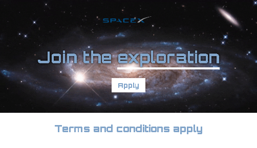

# Lets Go to Space

> HTML and CSS 

Project developed towards space

<a href="">Click here to acess</a>

## 🛠Technology
- HTML
- CSS
- Git and GitHub

## 📚 What I've learned
I learned to work with different types of backgrounds and their values.  
Color manipulation, hexadecimal, RGB, HSL and global values

## 📧📞 Contact
<a>rochalucassilva0@gmail.com</a>  
+55(11)96346-5369
